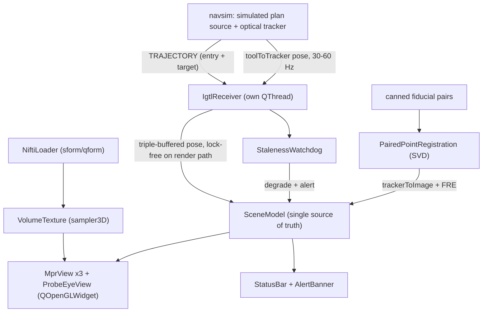

# Neuro-Navigation-Console

Research software. Not a medical device, not for clinical use.

An intra-operative neuronavigation console prototype in Qt/C++: a brain MRI volume in
three synced MPR views, a live OpenIGTLink stream carrying both the planned trajectory
and tool poses, paired-point registration between tracker and image space, and a
safety layer that refuses to show a stale pose as if it were live.

## Architecture

### Components

| Component | Responsibility |
| --- | --- |
| `NiftiLoader` + `VolumeTexture` | Parse NIfTI-1, derive `voxelToImage` from sform/qform, upload voxels as a GL 3D texture |
| `SceneModel` | The only mutable state: volume, registration, plan, live pose, FRE, alerts, telemetry |
| `MprView` x3 | Orthogonal slices with window/level, zoom/pan and a linked crosshair |
| `IgtlReceiver` + `navsim` | TRAJECTORY on connect, then tool poses in tracker space; received off the GUI thread |
| `PairedPointRegistration` | SVD rigid solver over canned fiducial pairs, producing `trackerToImage` and FRE |
| Tool overlay | Tip and shaft on all three planes, distance-to-target and angular deviation vs the plan |
| Safety layer | Staleness watchdog, no-plan-received state, alert banner, telemetry status bar |

`SceneModel` is the single source of truth and views are pure renderers of it, which is
what makes the probe's-eye and second-display views nearly free.

### Coordinate frames

Every displayed tool position is the composition of three separately unit-tested
transforms:

- `voxelToImage` — from the NIfTI header. Voxel indices to millimetres in image world space.
- `trackerToImage` — computed by registration, not hard-coded. `navsim` places the
  tracker frame at a non-trivial rotation and offset from image world, so this transform
  is load-bearing.
- `toolToTracker` — streamed from the tracker. Tool space is tip-at-origin with the shaft
  along `+Z`, so the pose's third rotation column is the shaft direction.

### Real-time behaviour

Poses arrive at 30–60 Hz and cross to the render path through a triple buffer, so the
render loop never blocks or allocates. If no pose arrives within ~100 ms the watchdog
greys the tool overlay and raises an alert rather than leaving a frozen pose looking
live. Registration quality gates navigation mode: above the FRE threshold, guidance is
withheld.
